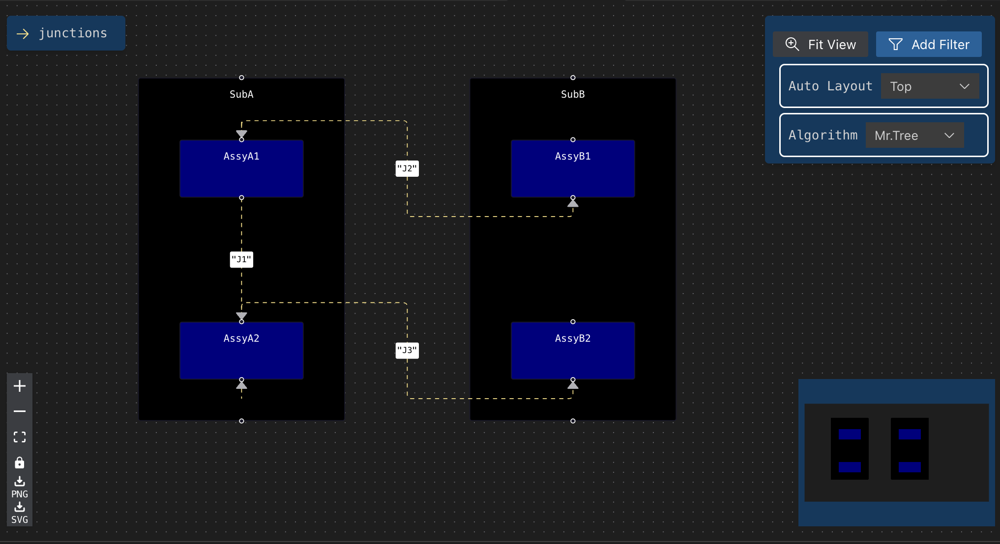
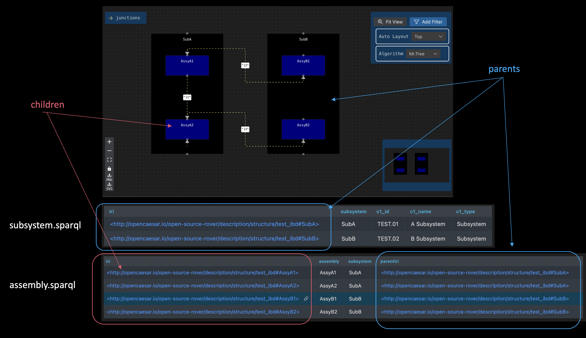

# OML-Vision Demo of Block Diagram Views

This is an example model of a [Block Diagram View](https://en.wikipedia.org/wiki/Block_diagram) using [OML-Vision](https://github.com/opencaesar/oml-vision).





[OML-Vision](https://github.com/opencaesar/oml-vision) understands the parent-child relationship using the IRI information obtained from the SPARQL query when the parent block contains child blocks. In this case, the IRI of the child should be obtained with the ?iri key and the IRI of the parent should be specified with ?parentIri or a key ending with 'Iri'.


diagramLayouts.json

```json
{
  "ibd": {
    "name": "IBD",
    "queries": {
      "subsystem": "subsystem.sparql",
      "assembly": "assembly.sparql",
      "edge": "junction.sparql"
    },
    "rowMapping": {
      "id": "subsystem",
      "name": "Subsystem",
      "labelFormat": "{subsystem}",
      "nodeColor": "Black",
      "nodeTextColor": "white",
      "nodeType": "{c1_type}",
      "subRowMappings": [
        {
          "id": "assembly",
          "name": "Assembly",
          "labelFormat": "{assembly}",
          "nodeColor": "Navy",
          "nodeTextColor": "white",
          "nodeType": "subsystem",
          "edgeMatchKey": "assembly"
        }
      ]
    },
    "edges": [
      {
        "id": "edge",
        "name": "Edge",
        "animated": true,
        "labelFormat": "{j1_localname}",
        "legendItems": "junctions",
        "sourceKey": "from",
        "targetKey": "to"
      }
    ]
  }
}
```
  
  
  
  



subsystem.sparql for parents.


```sparql
PREFIX base:        <http://imce.jpl.nasa.gov/foundation/base#>
PREFIX mission:     <http://imce.jpl.nasa.gov/foundation/mission#>
PREFIX structure:   <http://opencaesar.io/open-source-rover/vocabulary/structure#>
PREFIX rdfs:        <http://www.w3.org/2000/01/rdf-schema#>

SELECT DISTINCT ?iri ?subsystem ?c1_id ?c1_name ?c1_type
WHERE {

    VALUES ?componentType { structure:Subsystem }

	?iri a ?componentType ;
		base:hasIdentifier ?c1_id ;
		base:hasCanonicalName ?c1_name ;

	OPTIONAL {
		?iri a structure:System ;
			BIND("System"  AS ?c1_type) .
	}
	OPTIONAL {
		?iri a structure:Subsystem ;
			BIND("Subsystem"  AS ?c1_type) .
	}
	OPTIONAL {
		?iri a structure:Assembly ;
			BIND("Assembly"  AS ?c1_type) .
	}
    BIND(STRAFTER(STR(?iri), "#") AS ?subsystem) .

}
ORDER BY ?c1_id
```


assembly.sparql for children.

```sparql
PREFIX base:        <http://imce.jpl.nasa.gov/foundation/base#>
PREFIX mission:     <http://imce.jpl.nasa.gov/foundation/mission#>
PREFIX structure:   <http://opencaesar.io/open-source-rover/vocabulary/structure#>
PREFIX rdfs:        <http://www.w3.org/2000/01/rdf-schema#>

SELECT DISTINCT ?iri ?assembly ?subsystem ?parentIri
WHERE {


	?parentIri structure:hasAssembly ?iri ;
		base:hasIdentifier ?c1_id ;
		base:hasCanonicalName ?c1_name ;

    BIND(STRAFTER(STR(?parentIri), "#") AS ?subsystem) .
    BIND(STRAFTER(STR(?iri), "#") AS ?assembly) .

}
ORDER BY ?c1_id
```